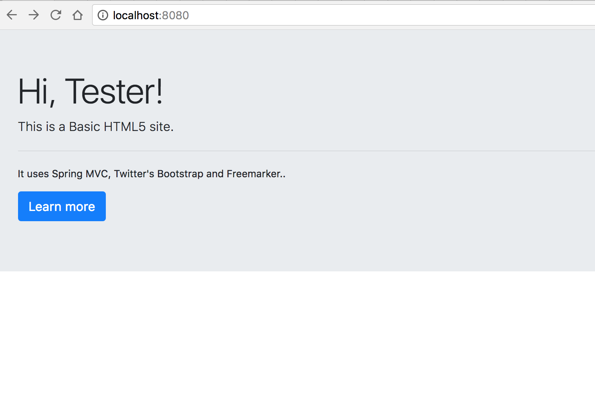

#Basic HTML5 Site

Spring MVC, Twitter's Bootstrap and Freemarker.





##Running on OpenShift:

```
$ rhc app create MyApp jbossas-7

$ cd MyApp

$ rm *

$ git remote add upstream -m master https://github.com/santiagoangel/basichtml5site

$ git pull -s recursive -X theirs upstream master

// .... change some code ...

$ git add *

$ git commit -m "My first change"

$ git push
```

##Running on JBoss EAP 6, JBoss AS 7 or other Java AS:

Download gradle from http://www.gradle.org/ and install http://www.gradle.org/docs/current/userguide/userguide_single.html#installation

Download this project in zip format 

```
$ wget https://github.com/santiagoangel/basichtml5site/archive/master.zip
```
Unzip

Build

```
$ cd basichtml5site

$ gradle build
```

Copy deployments/ROOT.war to the AS deployment directory or deploy it with (web) console.
